# CPReady Firmware Program Flow & Algorithm Specification

Prepared for **Sir Reyn** (Hardware & Electrical Consultant)  
Project: **CPReady** – ESP32-Based Supplementary CPR Training Device & Mobile App

---

## 1. High-Level Firmware State Machine

```mermaid
graph TD
    subgraph BOOT_INIT["1. Boot and Hardware Initialization"]
        PowerOn["ESP32 Power On / Reset"] --> InitI2C["Initialize I2C at 400kHz Fast Mode"]
        InitI2C --> InitSensors["Detect MPU6050 Primary (0x68) and Reference (0x69)"]
        InitSensors --> InitBLE["Start BLE GATT Server and Advertise CPReady"]
        InitBLE --> WaitApp["Wait for Flutter App Connection"]
    end

    subgraph CALIBRATION["2. Hand-Placement and Idle Calibration"]
        Connected["BLE Connected to Mobile App"] --> InstructReady["App Prompts: Place Hands on Chest Pad"]
        InstructReady --> SampleIdle["Sample 200 Readings (2 Seconds Idle)"]
        SampleIdle --> StoreBaselines["Compute Static Gravity Vectors (g_chest, g_base)"]
        StoreBaselines --> ReadyTone["Beep Buzzer and Send CALIBRATED Status via BLE"]
    end

    subgraph SAMPLING_LOOP["3. High-Speed 100Hz Sampling Loop"]
        ReadSensors["Read Accel (X,Y,Z) from Both MPUs"] --> DiffAccel["Calculate Differential Vertical Accel: a_net = a_chest - a_base"]
        DiffAccel --> LowPass["Apply 3-Point Moving Average Low-Pass Filter"]
    end

    subgraph PEDOMETER_CORE["4. Harmonic Pedometer and Cycle Detection"]
        CheckThreshold{"Is a_net beyond Compression Threshold?"} -->|"No (Idle or Paused)"| TrackPause["Increment Pause Timer and Check CCF"]
        CheckThreshold -->|"Yes"| StrokeActive["Track Cycle Extremes (a_min, a_max)"]
        StrokeActive --> ZeroCrossing{"Zero-Crossing Detected on Upstroke?"}
        ZeroCrossing -->|"No"| ContinueStroke["Continue Tracking Cycle Window"]
        ZeroCrossing -->|"Yes (Stroke Complete)"| ComputeMetrics["Calculate Stroke Parameters"]
    end

    subgraph METRIC_MATH["5. Cycle Parameter Calculations"]
        ComputeMetrics --> CalcRate["Compute Instant Rate: 60 / Cycle Period (cpm)"]
        CalcRate --> CalcDepth["Compute Algebraic Depth: K * (a_max - a_min) * T^2"]
        CalcDepth --> CheckRecoil["Evaluate Recoil: Baseline Return Check"]
        CheckRecoil --> UpdateCCF["Accumulate Active Compression Time for CCF"]
    end

    subgraph BLE_DISPATCH["6. BLE Notification and Local Feedback"]
        EvalTargets["Compare Against AHA Criteria (Depth, Rate, Recoil)"] --> PackPayload["Pack 8-Byte Binary Payload"]
        PackPayload --> SendBLE["Push BLE Notify Characteristic to Flutter App"]
        SendBLE --> LocalBuzzer["Trigger Optional Metronome / Prompt Audio"]
    end

    subgraph SESSION_END["7. Session Finalization"]
        StopTrigger{"Instructor Pressed Stop or Session Timeout?"} -->|"Yes"| FinalizeSession["Compute Overall Session CCF and Summary"]
        FinalizeSession --> SaveSummary["Transmit Final Summary and Return to Standby"]
    end

    %% Clean cross-subgraph transitions
    WaitApp --> Connected
    ReadyTone --> ReadSensors
    LowPass --> CheckThreshold
    ContinueStroke --> ReadSensors
    TrackPause --> ReadSensors
    UpdateCCF --> EvalTargets
    LocalBuzzer --> StopTrigger
    StopTrigger -->|"No"| ReadSensors
```

---

## 2. Mathematical Formulation of the Harmonic Estimator

### 2.1 Differential Vertical Acceleration
To isolate sternal compression from surface movement (such as a flexing floor, table, or foam mat), the raw acceleration from the back/spine reference sensor is subtracted from the chest sensor along the primary compression axis:
$$a_{\text{net}}(t) = \left(a_{\text{chest}, z}(t) - g_{\text{chest}, z}\right) - \left(a_{\text{base}, z}(t) - g_{\text{base}, z}\right)$$

### 2.2 Instantaneous Compression Rate
The period $T$ between successive upward zero-crossings or peak acceleration points is measured using microsecond hardware timers:
$$\text{Rate (cpm)} = \frac{60}{T_{\text{cycle}}}$$
A refractory lockout window of 250 ms ($> 240\text{ cpm}$) rejects high-frequency impact ringing and double-trigger artifacts.

### 2.3 Algebraic Depth Estimation
Under quasi-sinusoidal compression mechanics ($x(t) = A \sin(\omega t)$), peak-to-peak acceleration $a_{p-p} = a_{\max} - a_{\min}$ relates algebraically to total displacement $D = 2A$:
$$a(t) = -\omega^2 x(t) = -\left(\frac{2\pi}{T}\right)^2 x(t)$$
$$D = K \cdot \frac{a_{p-p}}{\left(2\pi / T\right)^2} = K \cdot \frac{(a_{\max} - a_{\min}) \cdot T^2}{4\pi^2}$$
where $K$ is an empirical calibration scalar determined once during benchtop calibration against a linear reference rule.

### 2.4 Chest Compression Fraction (CCF)
A rolling activity timer increments whenever consecutive compressions occur within $1.5\text{ seconds}$ of each other:
$$\text{CCF (\%)} = \left(\frac{T_{\text{active}}}{T_{\text{total}}}\right) \times 100\%$$

---

## 3. Compact BLE Notification Packet Specification

The ESP32 pushes an 8-byte structured binary payload on each completed compression cycle (or at a throttled rate of 5–10 Hz) via a custom BLE Notify characteristic:

| Byte Offset | Field Name | Data Type | Units / Scale | Description |
| :--- | :--- | :--- | :--- | :--- |
| `0..1` | `compression_rate` | `uint16_t` | 1 cpm | Instantaneous rate (Target: 100–120 cpm) |
| `2..3` | `compression_depth` | `uint16_t` | 0.1 mm | Compression depth (Target: 500–600 = 5.0–6.0 cm) |
| `4` | `recoil_status` | `uint8_t` | Boolean (0 or 1) | 1 = Full chest recoil; 0 = Incomplete return / leaning |
| `5` | `ccf_percent` | `uint8_t` | 1% | Current session CCF (Target: $\ge 60\%$) |
| `6..7` | `elapsed_seconds` | `uint16_t` | 1 s | Cumulative session runtime |
