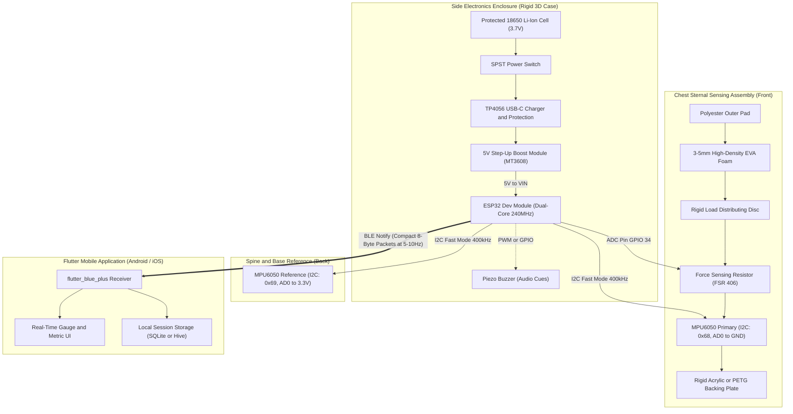
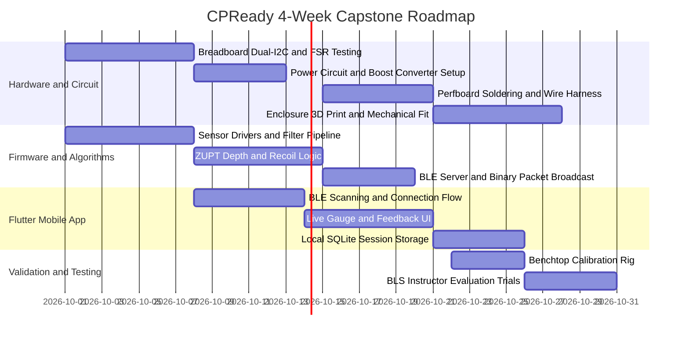

# CPReady Technical Consultation & Hardware Architecture Guide

Prepared for **Sir Reyn** (Hardware & Electrical Consultant)  
Project: **CPReady** – ESP32-Based Supplementary CPR Training Device & Mobile App  
Target Audience: Senior High School STEM–Health Allied Researchers (BNHS–SHS)

---

## 1. Executive Summary & Architecture Overview

CPReady is an ESP32-powered wearable training jacket or vest fitted onto a CPR manikin to provide real-time objective feedback on four American Heart Association (AHA) CPR indicators:
- **Compression Depth**: 5.0 to 6.0 cm (adult target)
- **Compression Rate**: 100 to 120 compressions per minute
- **Chest Recoil**: Complete release between strokes (preventing leaning)
- **Chest Compression Fraction (CCF)**: Proportion of active compression time ($\ge 60\%$, ideally $> 80\%$)

### System Architecture Diagram

---

## 2. Review of Sir Reyn's Initial Notes ([MyNotes.txt](file:///c:/Users/reynq/OneDrive/Documents/CPReady/MyNotes.txt))

### Questions for the Students
- **Firmware & MCU Experience**: Crucial starting point. If the students have minimal embedded C++ experience, all complex sensor math and BLE configuration must reside in well-structured, modular Arduino/ESP-IDF libraries.
- **Soldering Proficiency**: Novice soldering on vibrating prototypes causes cold joints and short circuits. Recommend that the students practice on stripboards first, while final critical harness connections are reviewed or soldered under supervision.
- **Breadboard vs. Permanent Assembly**: Solderless breadboards should be restricted exclusively to desk benchtop validation. Compressive impacts from CPR will loosen jumper wires instantly.

### Mechanical & Physical Protection
- **Force Segregation**: Placing only the sensing stack on the sternum while offloading the ESP32, battery, charging board, and switch into a rigid side box (left flank) is the correct architectural choice.
- **Crush Protection**: Compressions exert 50 kg of force. The chest housing requires a rigid bottom plate (PETG or acrylic) and a load-distribution disc buffered by high-density EVA foam so the sensor does not suffer point-load destruction.
- **Fabrication Resources**: 3D printing the enclosures in PETG via Kuya Ariel is strongly recommended over PLA, as PETG offers superior impact resistance and flexibility under cyclic shock.

---

## 3. Critical Technical Pitfalls (What Might Be Overlooked)

### Pitfall 1: Double-Integration Displacement Drift
- **The Physics Problem**: Calculating depth by integrating raw accelerometer data twice ($\iint a(t)\,dt^2$) inherently causes catastrophic baseline drift within 3 to 5 seconds due to sensor bias, integration error, and tilt.
- **The Solution**: Naive continuous integration will fail. The firmware must implement a **cycle-by-cycle Zero-Velocity Update (ZUPT)** or a bandpass filter (0.5 Hz to 5.0 Hz). Because CPR consists of repetitive cyclic strokes, velocity and displacement must be forcibly reset to zero at every inflection point (chest recoil turnaround).

### Pitfall 2: The Danger of Removing the FSR (Chest Recoil Failure)
- **The Physics Problem**: Sir Kherbin suggested removing the FSR in favor of dual MPU6050s. However, accelerometers **cannot detect static rescuer leaning**. When a student rests their upper body weight on the chest without moving, acceleration is exactly zero (static 1g gravity), identical to a complete release.
- **The Solution**: **Retain the FSR**. The FSR directly measures residual contact pressure. If force does not return below a calibrated preload threshold (e.g., $< 2.5\text{ N}$) at the top of the stroke, the system flags incomplete recoil. The dual-MPU handles motion/depth, while the FSR handles contact and recoil.

### Pitfall 3: The 18650 Battery Brownout Trap
- **The Electrical Problem**: Feeding a single 3.7V 18650 cell directly into the ESP32 `VIN` pin will cause random resets. The onboard AMS1117 regulator requires an input voltage of at least $3.3\text{V} + 1.1\text{V} = 4.4\text{V}$. When the battery operates at its nominal 3.7V, the regulator drops out, and the ESP32 browns out the moment the Bluetooth Low Energy radio transmits.
- **The Solution**: Add a miniature **5V step-up boost converter** (such as an MT3608 or a TP4056 booster combo board) between the battery and the ESP32 `VIN` pin to guarantee an uninterrupted 5.0V supply rail.

### Pitfall 4: Cyclic Wire Fatigue & Strain Relief
- **The Mechanical Problem**: Solid-core jumper wires flex and snap after dozens of 100-cpm compressions.
- **The Solution**: Use **24–26 AWG multi-stranded silicone-insulated wire** with hot-glue potting or mechanical zip-tie anchor clamps inside the 3D-printed enclosure.

### Pitfall 5: BLE Throughput & Packet Saturation
- **The Software Problem**: Streaming raw 100Hz IMU values over BLE causes packet drops, connection lag, and app crashes on Android/iOS.
- **The Solution**: Implement **Edge Computing** on the ESP32. The microcontroller does all sampling, filtering, and indicator calculation locally. It only pushes finished metrics (depth, rate, recoil flag, CCF) over BLE at **5 Hz to 10 Hz** or on every completed compression event.

---

## 4. Hardware Pinout & Wiring Table

| Component | Component Pin | ESP32 Pin | Function / Notes |
| :--- | :--- | :--- | :--- |
| **MPU6050 #1 (Chest)** | VCC | 3.3V | Primary motion sensor |
| | GND | GND | Ground return |
| | SCL | GPIO 22 | I2C Clock (Shared Bus, 400kHz Fast Mode) |
| | SDA | GPIO 21 | I2C Data (Shared Bus) |
| | AD0 | GND | Hardware I2C Address = **0x68** |
| | INT | GPIO 19 (Optional)| Hardware motion interrupt |
| **MPU6050 #2 (Back/Spine)**| VCC | 3.3V | Base reference sensor (manikin movement) |
| | GND | GND | Ground return |
| | SCL | GPIO 22 | Shared I2C Clock |
| | SDA | GPIO 21 | Shared I2C Data |
| | AD0 | 3.3V | Hardware I2C Address = **0x69** |
| **FSR 406 (Chest)** | Pin 1 | 3.3V | Voltage divider high side |
| | Pin 2 | GPIO 34 (ADC1_CH6)| Analog input across 10kΩ fixed pulldown to GND |
| **Piezo Buzzer** | Positive (+) | GPIO 25 | Local audio metronome & feedback tone |
| | Negative (-) | GND | Ground return |
| **Power System** | 5V Boost Out (+) | VIN | Regulated 5V input rail to ESP32 |
| | Boost Out (-) | GND | System common ground |

---

## 5. Answers to the Students' 16 Hardware Questions

### Q1: Alignment of Proposed Components with Required Functions
- The ESP32, dual MPU6050s, FSR, protected 18650 cell, and TP4056 align directly with the required CPR parameters (depth, rate, recoil, CCF). The ESP32's dual-core processor easily isolates real-time mathematical calculations on Core 0 from BLE communications on Core 1.

### Q2: Technical Conflicts, Overheating, or Compatibility Issues
- No component conflicts exist if the two MPU6050 sensors are assigned distinct I2C addresses (0x68 and 0x69) and the I2C clock is set to 400 kHz (`Wire.setClock(400000)`). Total power draw is less than 350 mA peak during BLE transmission, meaning heat generation is minimal and well within safe limits.

### Q3: Sensor Setup: MPU6050 Alone vs. MPU6050 + FSR
- Using both sensors in a hybrid arrangement is significantly superior. The MPU6050 calculates kinematic movement and rate, while the FSR provides unambiguous detection of physical contact, compression onset, and static leaning (incomplete recoil).

### Q4: Deriving Depth in Centimeters from an FSR
- An FSR cannot accurately or universally measure displacement in centimeters. Manikin foam stiffness degrades over time and varies with temperature and manikin model. Centimeter depth must be derived from the chest MPU6050 accelerometer with cycle-reset integration, using the FSR only as a boundary trigger.

### Q5: FSR Circuit Configuration & Resistor Values
- Connect the FSR in a voltage divider between 3.3V and an ADC pin (e.g., GPIO 34), with a **10 kΩ fixed pulldown resistor** connected from the ADC pin to GND. Configure the ESP32 ADC attenuation to 11 dB (`ADC_ATTEN_DB_11`) for a 0–3.1V measuring range.

### Q6: FSR Form Factor Selection
- The **Interlink FSR 406** (38 mm × 38 mm square active area) is ideal. Smaller circular pads (e.g., FSR 402, 13 mm diameter) are easily missed if a trainee's hand placement is slightly off-center.

### Q7: Force-Distribution Layer & Padding
- Use **3 mm to 5 mm high-density EVA foam** placed over a thin, rigid load-distribution disc (acrylic or 3D-printed PETG). This spreads the force evenly over the FSR active area and prevents sharp point-load stress from damaging the sensor.

### Q8: Durability Under Repeated CPR Impact
- Repeated 50-kg impacts will destroy bare printed circuit boards. The chest sensor assembly must be housed inside a low-profile rigid shell, potted or secured with silicone, with all wires anchored with strain-relief loops. The ESP32 and battery must remain completely isolated in the side enclosure.

### Q9: Manikin Fastening & Harness Configuration
- Use **polyester elastic webbing (25–38 mm wide)** with quick-release ladder-lock buckles. An adjustable thoracic wrap with crossed shoulder straps prevents vertical and rotational slipping during intense chest compressions.

### Q10: Battery, Voltage Regulation, & Runtime
- Use a single **protected 18650 Li-ion cell (2600–3000 mAh)** paired with a **TP4056 USB-C charging module** and a **5V step-up boost converter** feeding the ESP32 `VIN` pin. This configuration guarantees 6 to 8 hours of continuous operation, far exceeding the one-hour requirement, while eliminating brownout resets.

### Q11: Wiring, Solder Transition, & Prototyping Stages
- Begin with jumper wires on a solderless breadboard for bench testing. Once validated, transfer all connections to a **soldered perfboard or custom PCB** using **24–26 AWG stranded silicone hook-up wire** and JST-XH disconnect connectors.

### Q12: Nonessential Features That Should Be Removed
- Eliminate cloud databases, user authentication, multi-user pairing, and complex historical analytics. Keep the device focused strictly on real-time feedback and local session logging.

### Q13: Processing Division: ESP32 vs. Mobile Application
- The ESP32 must perform all raw analog reading, digital filtering, peak detection, depth integration, and metric calculation. The mobile application should function solely as a display and logging terminal, receiving pre-calculated metrics.

### Q14: Sensor Synchronization & Metric Accuracy
- Sample both MPU6050 sensors synchronously at **100 Hz** on the same I2C bus. To calculate net compression acceleration, subtract the base sensor's vertical acceleration from the chest sensor's vertical acceleration before integrating.

### Q15: One-Month Development Timeline Prioritization
- **Week 1**: Benchtop sensor testing, I2C address verification, and basic signal filtering.
- **Week 2**: Firmware algorithm implementation (ZUPT depth integration and rate calculation) and basic BLE payload transmission.
- **Week 3**: Enclosure 3D printing, harness fitting, and transition to soldered perfboard.
- **Week 4**: Reference calibration against a ruler or instructor checklist, app UI integration, and validation trials.

### Q16: Overall Technical Feasibility Assessment
- The CPReady concept is completely feasible provided the team keeps the software scope lean, retains the FSR for recoil detection, uses a 5V boost converter on the battery rail, and avoids continuous open-loop double integration.

---

## 6. Answers to the Students' 5 Application Questions

### App Q1: Complete Data Pathway from Sensors to Flutter
- **Sensors $\rightarrow$ ESP32 Core 0 (ADC/I2C at 100Hz) $\rightarrow$ Indicator Algorithm $\rightarrow$ ESP32 Core 1 (BLE Server) $\rightarrow$ Flutter App (`flutter_blue_plus`) $\rightarrow$ Provider/Riverpod State $\rightarrow$ UI Gauges & Local Database.** The ESP32 does the heavy lifting; the app remains lightweight and responsive.

### App Q2: BLE Packet Structure & Data Organization
- Use an **8-byte compact binary payload** transmitted via a single custom BLE Notify characteristic:
  - `uint16_t compression_rate` (e.g., 112 cpm)
  - `uint16_t compression_depth_mm` (e.g., 54 mm = 5.4 cm)
  - `uint8_t recoil_status` (1 = full recoil, 0 = incomplete/leaning)
  - `uint8_t ccf_percent` (e.g., 82%)
  - `uint16_t session_elapsed_sec` (e.g., 120 s)

### App Q3: BLE Configuration & Update Frequency
- Set BLE connection intervals to **20 ms to 40 ms**. Transmit notification packets at **5 Hz to 10 Hz** during active compressions. This provides immediate visual feedback without overflowing mobile BLE queues.

### App Q4: Connection Fault Tolerance & Session Recovery
- The Flutter app must monitor connection state streams. If a disconnection occurs, the app should automatically pause the session timer, show a reconnect banner, and attempt automatic reconnection (`autoConnect: true`). Metrics accumulated prior to disconnection must be preserved in local app state.

### App Q5: Scope Simplification & Architecture Sufficiency
- The simplified single-practice flow (Splash $\rightarrow$ Connect $\rightarrow$ Practice with Live Feedback $\rightarrow$ Session Summary $\rightarrow$ Local History) is optimal. Avoid web portals or multi-screen onboarding until the core feedback loop is rock solid.

---

## 7. Recommended 4-Week Milestone Roadmap

---
*Guide compiled for Sir Reyn’s technical consultation sessions with the BNHS-SHS CPReady research team.*
