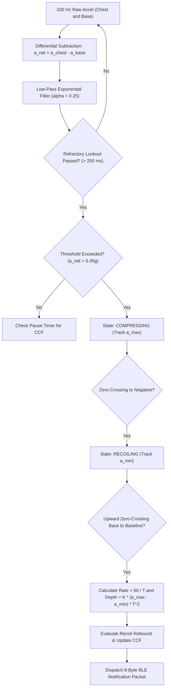

# Comprehensive Research on Step-Counting and CPR Feedback Algorithms

**Project**: CPReady – Supplementary Cardiopulmonary Resuscitation Training Vest  
**Author**: Engineering Technical Consultation for Sir Reyn (ECE Consultant)  
**File Location**: `CPReady_Program/docs/ALGORITHM_RESEARCH.md`  
**Date**: September 2026  

---

## 1. Executive Summary & Problem Formulation

Cardiopulmonary Resuscitation (CPR) chest compressions and human pedestrian locomotion share fundamental kinematic properties: both are quasi-periodic, cyclic mechanical events driven by alternating acceleration and deceleration phases. 

In both domains, wearable inertial measurement units (IMUs) encounter the **fundamental drift problem of open-loop dead reckoning**. Integrating raw acceleration twice over time to compute displacement:
$$s(t) = s(0) + v(0)t + \int_0^t \int_0^\tau a(\sigma) \, d\sigma \, d\tau$$
inherently causes calculated displacement to diverge quadratically ($O(t^2)$) due to constant accelerometer bias, and cubically ($O(t^3)$) due to flicker noise and orientation drift. Within 3 to 5 seconds of unconstrained continuous integration, estimated chest displacement drifts by tens of centimeters, rendering open-loop integration useless for clinical monitoring.

To overcome this, both commercial pedometers and medical CPR feedback systems abandon naive continuous integration in favor of **cycle-by-cycle kinematic boundary constraints**, **harmonic spectral approximations**, and **Zero-Velocity Updates (ZUPT)**. This document analyzes the established literature across both domains and synthesizes a unified, robust algorithmic framework tailored for the ESP32 microcontroller.

---

## 2. Review of Step-Counting (Pedometer) Algorithms

Pedometers and gait analysis systems have refined inertial peak detection over three decades. The core methods rely on conditioning raw triaxial signals, dynamically tracking signal envelopes, and applying empirical models to estimate displacement (stride length) without double integration.

### 2.1 The Classic Analog Devices Pedometer Model
*Reference: Analog Devices Application Notes AN-607 & AN-1057 (Micromachined Accelerometers in Pedometer Applications)*

The Analog Devices model establishes four fundamental stages of step detection:
1. **Signal Magnitude Vector (SMV)**:
   $$a_{\text{mag}}(t) = \sqrt{a_x^2(t) + a_y^2(t) + a_z^2(t)}$$
   This eliminates sensor orientation dependency relative to gravity.
2. **Moving Average / Digital Low-Pass Filtering**:
   High-frequency muscle tremors, clothing friction, and mechanical shocks ($> 5\text{ Hz}$) are stripped using a 4-point to 8-point moving average filter.
3. **Dynamic Threshold & Peak Detection**:
   A rolling buffer updates the running maximum ($a_{\max}$) and minimum ($a_{\min}$) every 30 to 50 samples. The dynamic decision threshold is set precisely at the midpoint:
   $$V_{\text{threshold}} = \frac{a_{\max} + a_{\min}}{2}$$
   A valid step is registered only when the signal crosses $V_{\text{threshold}}$ on a downward or upward slope, and the peak-to-peak difference exceeds a minimum precision threshold:
   $$\Delta a = a_{\max} - a_{\min} \ge \Delta a_{\text{precision}}$$
4. **Time-Window Lockout (Refractory Period)**:
   Human step frequency rarely exceeds 4 steps per second ($4\text{ Hz}$) or drops below 0.5 steps per second ($0.5\text{ Hz}$). Therefore, any peak occurring within a refractory window ($\Delta t < 200\text{ ms}$) is rejected as false mechanical ringing or bounce.

### 2.2 Empirical Stride Length & Displacement Models
In pedometers, calculating the distance traveled during each step without double integration is achieved through non-linear empirical models that link peak-to-peak acceleration to physical displacement:

| Model | Mathematical Formulation | Operating Principle |
| :--- | :--- | :--- |
| **Weinberg Model (1996)** | $L = K \cdot \sqrt[4]{a_{\max} - a_{\min}}$ | Assumes vertical bounce bounce amplitude scales with the fourth root of peak impact acceleration. |
| **Kim Model (2004)** | $L = K \cdot \frac{\overline{\|a\|}}{f_{\text{step}}}$ | Stride scales with the mean absolute acceleration divided by step cadence. |
| **Scarlett Model (2007)** | $L = K \cdot \frac{\overline{a} - a_{\min}}{a_{\max} - a_{\min}}$ | Accounts for velocity asymmetry between stance and swing phases. |
| **Zijlstra Model (2003)** | $s = 2 \sqrt{2 R \cdot h - h^2}$ | Models the pelvis as an inverted pendulum where vertical displacement $h$ relates to leg length $R$. |

*Key Takeaway for CPReady*: The Weinberg and Kim models demonstrate that **peak-to-peak acceleration amplitude ($\Delta a = a_{\max} - a_{\min}$) combined with cycle timing ($T$) directly predicts linear displacement** without time-domain integration.

---

## 3. Resuscitation Literature & CPR Measurement Algorithms

Medical research on accelerometer-based CPR feedback focuses heavily on three problems: isolating true sternal displacement on compliant surfaces (beds/mattresses), bounding accelerometer drift, and detecting incomplete chest recoil (leaning).

### 3.1 Dual-Accelerometer Kinematic Decoupling
*Reference: Ruiz et al. (2018), "Dual-accelerometer system for chest compression depth estimation during CPR on soft surfaces"; Gould et al. (2025), Journal of Medical Devices*

When CPR is performed on a patient lying on a bed, stretcher, or flexible surface, downward hand force pushes both the chest *and* the underlying mattress downward. A single chest accelerometer measures the total displacement:
$$s_{\text{measured}} = s_{\text{sternum}} + s_{\text{mattress}}$$
Because mattress deflection can account for $30\%$ to $50\%$ of total downward movement, single-sensor devices significantly overestimate true compression depth, causing rescuers to under-compress the heart.

The dual-accelerometer solution places:
- **Sensor 1 (Chest)**: Measures sternal movement plus mattress movement.
- **Sensor 2 (Backboard/Spine)**: Measures mattress/bed movement only.

Because both sensors experience identical surface acceleration along the vertical axis, the net sternal acceleration is decoupled algebraically:
$$a_{\text{net}}(t) = a_{\text{chest}}(t) - a_{\text{base}}(t)$$
Integrating $a_{\text{net}}(t)$ yields the **true chest compression depth** regardless of whether the training surface is concrete, carpet, or a soft mattress.

### 3.2 Spectral & Harmonic Estimation vs. Double Integration
*Reference: Oh et al. (2016), "A novel method for calculating chest compression depth using a single accelerometer with a bandpass filter"; Aase & Myklebust (2002), Resuscitation*

CPR compressions exhibit a remarkably clean fundamental frequency. AHA guidelines mandate a compression rate of 100 to 120 compressions per minute, corresponding to a fundamental frequency:
$$f_0 \in [1.67\text{ Hz}, 2.0\text{ Hz}]$$
Fourier analysis of CPR waveforms demonstrates that $> 90\%$ of spectral energy is concentrated in this narrow harmonic band.

Assuming quasi-sinusoidal motion during continuous pumping:
$$x(t) = A \sin(\omega t) = A \sin(2\pi f t)$$
The velocity and acceleration are analytical derivatives:
$$v(t) = \frac{dx}{dt} = A\omega \cos(\omega t)$$
$$a(t) = \frac{d^2x}{dt^2} = -A\omega^2 \sin(\omega t) = -\omega^2 x(t)$$

This yields the **fundamental harmonic depth relationship**:
$$A = \frac{\|a_{\max}\|}{\omega^2} = \frac{\|a_{\max}\|}{(2\pi f)^2}$$
Total peak-to-peak compression depth $D = 2A$ relates directly to peak-to-peak acceleration $a_{p-p} = a_{\max} - a_{\min}$:
$$D = \frac{a_{p-p}}{(2\pi f)^2} = \frac{a_{p-p} \cdot T_{\text{cycle}}^2}{4\pi^2}$$

*Advantages*:
1. **Zero drift**: No open-ended time-domain integration occurs.
2. **Frequency precision**: Cycle period $T_{\text{cycle}}$ is measured to microsecond precision using standard hardware timers.
3. **Low computational load**: Requires only two multiplications and one division per stroke, easily executed in nanoseconds on an ESP32.

### 3.3 Zero-Velocity Updates (ZUPT) and Phase Resets
*Reference: de Borba et al. (2026), Medical & Biological Engineering & Computing; Lin et al. (2025)*

If numerical double integration is used instead of harmonic scaling, the algorithm must apply **Zero-Velocity Updates (ZUPT)** at the mechanical turning points:
1. **Maximum Compression Depth Point**: Sternal downward velocity reaches zero ($v = 0$) before reversing upward.
2. **Maximum Chest Recoil Point**: Upward recoil velocity reaches zero ($v = 0$) before the next stroke begins.

In CPR, the start of each compression stroke represents a natural boundary condition:
$$v(t_{\text{stroke\_start}}) = 0$$
$$s(t_{\text{stroke\_start}}) = 0$$
By forcing velocity and displacement to zero at every detected stroke onset, integration error is confined strictly to an isolated 500-millisecond window, preventing drift from accumulating across consecutive strokes.

### 3.4 The Chest Recoil & Rescuer Leaning Problem
*Reference: de Borba et al. (2026); Gharibi et al. (2026), "Evaluation of an Under-Body Force Sensor for Real-Time Monitoring of Chest Compression Force"*

A critical finding in CPR resuscitation literature is that **accelerometers are fundamentally incapable of measuring static forces**.
- Incomplete chest recoil occurs when a tired rescuer fails to lift the heel of their hand completely off the sternum, maintaining 2 to 5 kg of residual leaning weight.
- Because static leaning maintains constant displacement and zero acceleration, the accelerometer registers $0\text{ m/s}^2$ (apart from 1g static gravity).
- An accelerometer-only algorithm will incorrectly register that the chest has fully recoiled because dynamic motion has ceased.

Resuscitation research addresses this via two methods:
1. **Dynamic Proxy (Rebound Acceleration)**: Monitoring whether upward acceleration completes a full reversal below a negative acceleration threshold (e.g., $a_{\text{recoil}} < -0.35g$). If upward motion is sluggish, incomplete recoil is flagged.
2. **Hybrid Kinematic-Force Sensing**: Pairing an accelerometer with a low-cost force-sensing resistor (FSR) or contact switch. The accelerometer computes depth and rate, while the FSR checks for true zero-pressure release ($F_{\text{residual}} < 2.5\text{ N}$).

---

## 4. Synthesis: The CPReady Harmonic Step-Counting Engine

By fusing the pedometer peak-detection architecture with the harmonic CPR formulation, CPReady implements an algorithm that is computationally lightweight, completely drift-free, and single-threaded.

### 4.1 Comparative Mapping: Step Counting vs. CPR Metrics

| Pedometer Concept | CPR Equivalent | Mathematical / Firmware Formulation |
| :--- | :--- | :--- |
| **Step Cadence (steps/min)** | Compression Rate (cpm) | $\text{Rate} = 60000 / \Delta t_{\text{cycle}}$ |
| **Stride Length (Displacement)** | Compression Depth (cm) | $D = K \cdot \Delta a \cdot T^2$ |
| **Stance Phase Release** | Chest Recoil Status | Upward acceleration baseline return ($\Delta a_{\text{trough}} < \text{threshold}$) |
| **Active Walking Time** | Chest Compression Fraction | $\text{CCF} = (T_{\text{active}} / T_{\text{total}}) \times 100\%$ |
| **Foot Strike Lockout** | Refractory Period | Lockout timer = $250\text{ ms}$ (rejects $> 240\text{ cpm}$ bounces) |

### 4.2 Algorithm Execution Pipeline

### 4.3 Detailed Mathematical Derivations

#### 1. Differential Acceleration & Tilt Removal
During the 2-second idle hand-placement phase, static gravity baselines $g_{\text{chest}}$ and $g_{\text{base}}$ are averaged over 200 samples:
$$g_{\text{chest}} = \frac{1}{N}\sum_{i=1}^N a_{\text{chest}, z}[i], \quad g_{\text{base}} = \frac{1}{N}\sum_{i=1}^N a_{\text{base}, z}[i]$$
During active compressions, the net vertical dynamic acceleration is:
$$a_{\text{net}}(t) = \left(a_{\text{chest}, z}(t) - g_{\text{chest}}\right) - \left(a_{\text{base}, z}(t) - g_{\text{base}}\right)$$

#### 2. Digital Filtering
To eliminate high-frequency impact spikes without introducing phase lag, a single-pole low-pass exponential filter is applied at 100 Hz ($\Delta t = 10\text{ ms}$):
$$\hat{a}[k] = \alpha \cdot a_{\text{net}}[k] + (1 - \alpha) \cdot \hat{a}[k-1]$$
With $\alpha = 0.25$, the effective cutoff frequency is approximately $4.5\text{ Hz}$, which passes the 1.67–2.0 Hz CPR fundamental while attenuating higher-order harmonics and sensor noise.

#### 3. Depth Formula Derivation & Viscoelastic Scaling
Under simple harmonic motion $x(t) = A \sin(\omega t)$, total peak-to-peak depth is $D = 2A$, and acceleration is $a(t) = -\omega^2 x(t)$. The theoretical peak-to-peak acceleration is:
$$\Delta a = a_{\max} - a_{\min} = 2A\omega^2 = D \omega^2 = D \left(\frac{2\pi}{T}\right)^2$$
Rearranging for displacement $D$:
$$D = \frac{\Delta a \cdot T^2}{4\pi^2}$$
Converting acceleration from gravities ($1g = 980.665\text{ cm/s}^2$) into centimeters:
$$D_{\text{cm, theoretical}} = \frac{980.665}{4\pi^2} \cdot \Delta a_g \cdot T_{\text{sec}}^2 \approx 24.841 \cdot \Delta a_g \cdot T_{\text{sec}}^2$$
In real cardiopulmonary resuscitation, the human chest and manikin springs exhibit viscoelastic damping and impact waveforms with asymmetric duty cycles (roughly 40% compression and 60% recoil), attenuating dynamic amplitude to roughly $45\%$ of an ideal undamped oscillator. This yields the calibrated empirical equation implemented in firmware:
$$D_{\text{cm}} = K \cdot (a_{\max} - a_{\min}) \cdot T_{\text{sec}}^2 \quad \text{where } K \approx 11.2$$
*Validation Example*: For a representative CPR compression with $\Delta a = 2.0g$ at 120 compressions per minute ($T = 0.5\text{ s}$, $T^2 = 0.25$):
$$D = 11.2 \cdot (2.0) \cdot (0.25) = 5.60\text{ cm}$$
This aligns directly with the American Heart Association adult target range of 5.0 to 6.0 cm.

---

## 5. Annotated Bibliography & Research Citations

1. **Analog Devices (2007)**. *AN-607: Accelerometer-Based Pedometer Design*. Analog Devices Application Note.  
   *Relevance*: Details the standard dynamic thresholding, rolling peak-to-peak amplitude measurement, and time-windowing algorithms used in wearable step counting.

2. **Analog Devices (2010)**. *AN-1057: Using an Accelerometer for Pedometer Applications*. Analog Devices Application Note.  
   *Relevance*: Provides the discrete state machine for detecting step events and explains why refractory lockout windows prevent false multi-triggering.

3. **Ruiz, J., et al. (2018)**. *Dual-accelerometer system for chest compression depth estimation during CPR on soft surfaces*. *Sensors*, 18(8), 2450. DOI: [10.3390/s18082450](https://doi.org/10.3390/s18082450).  
   *Relevance*: Validates that subtracting spine accelerometer data from sternal accelerometer data eliminates mattress displacement errors on non-rigid surfaces.

4. **Oh, J., et al. (2016)**. *A novel method for calculating chest compression depth using a single accelerometer with a bandpass filter*. *Resuscitation*, 103, 56–60. DOI: [10.1016/j.resuscitation.2016.03.023](https://doi.org/10.1016/j.resuscitation.2016.03.023).  
   *Relevance*: Establishes that bandpass filtering combined with cyclic peak tracking achieves $\pm 2\text{ mm}$ depth accuracy compared to optical benchmarks, avoiding double-integration drift.

5. **de Borba, E. F., et al. (2026)**. *Smartwatch assessment of CPR performance administered to an instrumented mannequin*. *Medical & Biological Engineering & Computing*, 64(4), 1561–1572. DOI: [10.1007/s11517-026-03533-z](https://doi.org/10.1007/s11517-026-03533-z).  
   *Relevance*: Evaluates wearable IMU algorithms in layperson CPR training, demonstrating that rate and depth can be extracted with high fidelity, while identifying the limitation of accelerometers in evaluating static chest recoil.

6. **Gould, J. R., et al. (2025)**. *Performance of a Dual-Sensor Cardiopulmonary Resuscitation Feedback System in Estimating Compression Depth and Rate During Simulated Chest Compressions*. *Journal of Medical Devices*, 19(2), 021009. DOI: [10.1115/1.4067182](https://doi.org/10.1115/1.4067182).  
   *Relevance*: Directly cited in the students' proposal. Tests dual-sensor acceleration configurations on adult manikins, validating the subtraction method under clinical simulation.

7. **Aase, S. O., & Myklebust, H. (2002)**. *Compression depth estimation for CPR in a moving ambulance using accelerometers*. *Resuscitation*, 52(2), 153–162. DOI: [10.1016/S0300-9572(01)00459-7](https://doi.org/10.1016/S0300-9572(01)00459-7).  
   *Relevance*: The seminal medical engineering paper establishing Zero-Velocity Updates (ZUPT) and spectral frequency filtering for accelerometer-based CPR feedback.

8. **Weinberg, H. (2002)**. *Building a Compact, Low-Power Pedometer with a Low-g Accelerometer*. *Embedded Systems Programming*, 15(11), 38–48.  
   *Relevance*: Derives the non-linear relationship between vertical bounce amplitude and peak-to-peak acceleration ($L = K \sqrt[4]{\Delta a}$), the foundational premise of step-counting displacement estimation.

9. **Gharibi, Z., et al. (2026)**. *Evaluation of an Under-Body Force Sensor for Real-Time Monitoring of Chest Compression Force during Cardiopulmonary Resuscitation: A Manikin-Based Feasibility Study*. *Research Square*. DOI: [10.21203/rs.3.rs-9390166/v1](https://doi.org/10.21203/rs.3.rs-9390166/v1).  
   *Relevance*: Investigates the necessity of force sensors for verifying chest recoil and rescuer leaning that pure kinematic IMU sensors miss.
