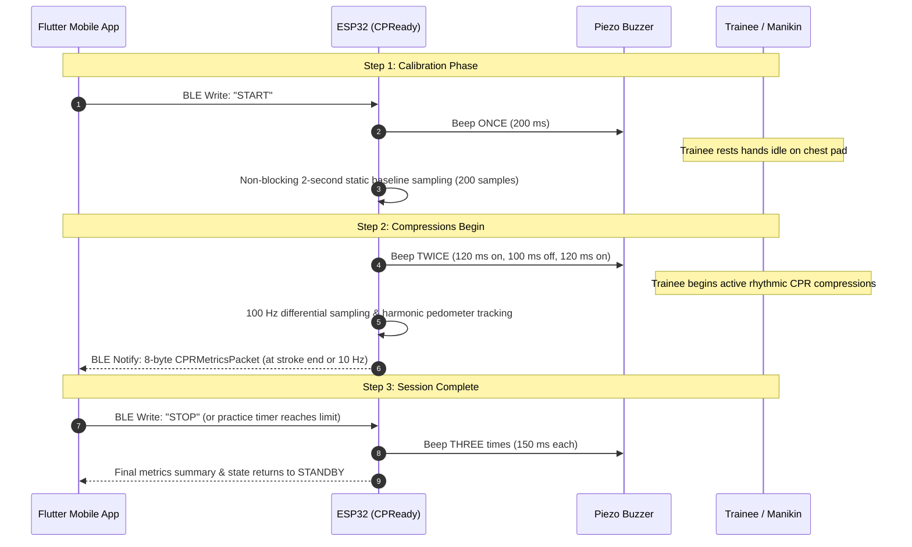
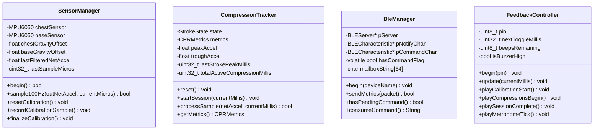

# CPReady Firmware Architecture Specification

**Project**: CPReady – Supplementary CPR Training Vest  
**Target Hardware**: ESP32 Dev Module (WROOM-32 / ESP32-S3)  
**Engineering Consultant**: Sir Reyn  
**Document Purpose**: Object-Oriented, Non-Blocking, Single-Threaded Architecture for Capstone Firmware Implementation

---

## 1. Architectural Principles & Constraints

### 1.1 Non-Blocking Execution Model
The firmware strictly prohibits the use of blocking delay calls (`delay()`) inside the active operational loop. All temporal operations—such as sensor sampling intervals (100 Hz), peak detection refractory lockouts (250 ms), Bluetooth Low Energy notification throttling (5–10 Hz), and audio metronome/buzzer patterns—are governed by discrete `millis()` or `micros()` software timers.

### 1.2 Single-Threaded Application Orchestration
While the ESP32 hardware employs dual Xtensa cores and runs FreeRTOS under the Arduino abstraction layer, all application logic, math pipelines, and state transitions are consolidated into a deterministic single-threaded execution flow within `loop()`. This prevents thread synchronization bugs, mutex contention, and race conditions, ensuring that software developers with Dart/Flutter or basic Arduino backgrounds can easily follow, debug, and modify the code.

### 1.3 Asynchronous BLE-to-Main-Loop Bridge
Because the underlying ESP32 BLE stack (such as `NimBLEDevice` or standard `BLEDevice`) processes radio packets within an asynchronous background FreeRTOS task, callbacks cannot directly manipulate the main application state without concurrency risks. Instead, incoming BLE write events place commands into a lightweight, volatile single-command mailbox. The main thread inspects this mailbox during its normal loop cycle and dispatches the standardized `onReceiveMessage_BLE` handler safely in the primary thread context.

---

## 2. Interactive Session & Audio Signaling Protocol

To provide clear physical and acoustic feedback without requiring the trainee to stare continuously at the smartphone screen, the firmware implements a standardized **1-2-3 Buzzer Protocol** paired with mobile button triggers:



---

## 3. High-Level Class Architecture



---

## 4. Software Extensibility: `onReceiveMessage_BLE`

The command dispatcher in the main sketch takes a simple string argument. This enables Flutter/Dart developers to add new buttons or features simply by mapping UI clicks to text messages:

```cpp
void onReceiveMessage_BLE(String message) {
    message.trim();
    message.toUpperCase();

    if (message == "START") {
        // Triggers 1 beep -> 2-sec calibration -> 2 beeps -> active session
        sensors.resetCalibration();
        calibrationStartMillis = millis();
        state = DeviceState::CALIBRATING;
        feedback.playCalibrationStart();
    }
    else if (message == "STOP") {
        // Triggers 3 beeps -> session finalization -> standby
        state = DeviceState::STANDBY;
        feedback.playSessionComplete();
    }
    else if (message == "PAUSE") {
        state = DeviceState::SESSION_PAUSED;
    }
    else if (message == "RESUME") {
        state = DeviceState::ACTIVE_SESSION;
    }
    // Software developers can easily add new custom commands here:
    else if (message.startsWith("SET_TIME:")) {
        int sec = message.substring(9).toInt();
        practiceDurationSec = sec;
    }
}
```

---

## 5. Binary BLE Notification Packet (8 Bytes)

The ESP32 pushes an 8-byte structured binary payload on each completed compression cycle (or at a throttled rate of 5–10 Hz) via a custom BLE Notify characteristic:

| Byte Offset | Field Name | Data Type | Units / Scale | Description |
| :--- | :--- | :--- | :--- | :--- |
| `0..1` | `compression_rate` | `uint16_t` | 1 cpm | Instantaneous rate (Target: 100–120 cpm) |
| `2..3` | `compression_depth` | `uint16_t` | 0.1 mm | Compression depth (Target: 500–600 = 5.0–6.0 cm) |
| `4` | `recoil_status` | `uint8_t` | Boolean (0 or 1) | 1 = Full chest recoil; 0 = Incomplete return / leaning |
| `5` | `ccf_percent` | `uint8_t` | 1% | Current session CCF (Target: $\ge 60\%$) |
| `6..7` | `elapsed_seconds` | `uint16_t` | 1 s | Cumulative session runtime |
