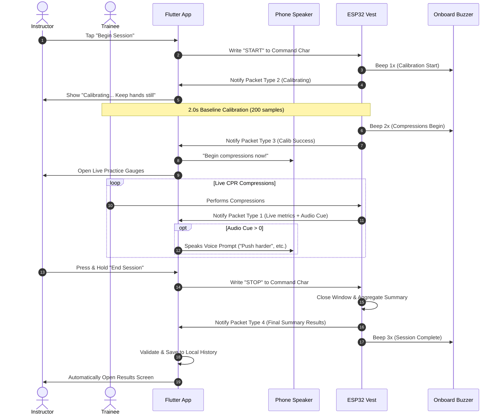
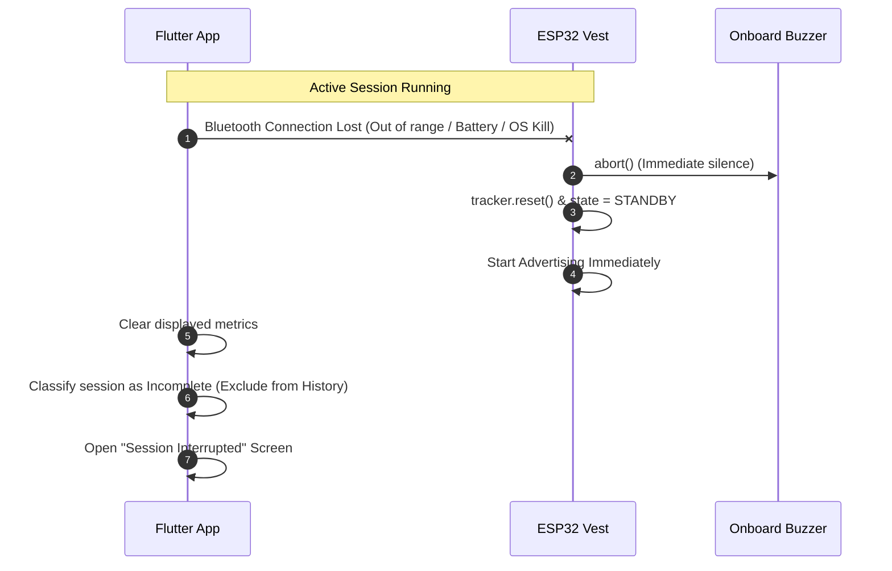

# CPReady Software Developer Integration Guide

**Target Audience**: Flutter / Mobile Application Developers & Firmware Contributors  
**Hardware Platform**: ESP32 Dev Module (Dual MPU6050 Accelerometers, Piezo Buzzer)  
**Primary Communication**: Bluetooth Low Energy (Nordic UART Service GATT Profile)  
**Document Status**: Official Protocol Specification (Aligned with Capstone Proposal)  

---

## 1. System Overview

The **CPReady** firmware turns an ESP32 into a smart CPR training vest worn over a resuscitation manikin. It tracks the four core American Heart Association (AHA) quality metrics:
- **Compression Rate**: Target 100–120 compressions per minute (cpm).
- **Compression Depth**: Target 50–60 mm (5.0–6.0 cm).
- **Chest Recoil**: Verification of complete upward chest release between downstrokes (flags rescuer leaning).
- **Chest Compression Fraction (CCF)**: Target $\ge 60\%$, ideally $> 80\%$ active compression time.

### Audio Separation of Concerns
- **ESP32 Hardware Buzzer**: Handles physical device state beeps:
  - 1 beep: Calibration baseline window underway.
  - 2 beeps: Baseline captured, compressions begin now!
  - 3 beeps: Practice session finalized / completed.
- **Smartphone Speaker (Flutter App)**: Delivers all spoken voice coaching (*"Push harder"*, *"Release completely"*, *"Speed up"*, *"Slow down"*, *"Good compressions"*) and sound effects.

---

## 2. Technical Verification Resolutions (Hardware to Software Agreement)

Below are the explicit engineering agreements answering the **"For Technical Verification"** requirements in the student team's protocol specification:

### 1. Bluetooth Disconnection Handling
- **Firmware Behavior**: The ESP32 detects client disconnection instantly via `onDisconnect()`. On the very next tick, the firmware calls `feedback.abort()` (silencing the buzzer), clears `tracker.reset()`, and resets `state = DeviceState::STANDBY`.
- **Flutter Behavior**: When disconnection occurs, Flutter immediately terminates the active session, clears displayed live metrics to avoid showing stale data, and displays the *"Session Interrupted"* notification screen. Interrupted sessions are **not** saved to History.
- **Reconnection**: The ESP32 resumes advertising immediately. Once re-paired, the instructor can initiate a clean new practice session.

### 2. STOP Command & Final Results Finalization
- **Sequence**:
  1. Instructor presses and holds "End Session" in Flutter.
  2. Flutter transmits the text string `"STOP"` to the Command Characteristic (`6e400003-...`).
  3. The ESP32 closes the measurement period, computes session averages (average depth, average rate, recoil compliance %, final CCF %, total compressions), and broadcasts an 11-byte summary packet with `packet_type = 4 (PKT_TYPE_FINAL_SUMMARY)`.
  4. The ESP32 plays 3 beeps and transitions to `STANDBY`.
  5. Flutter validates the packet, saves the session to local SQLite/Hive storage, and opens the Results screen.

### 3. Distinguishing Real-Time Telemetry from Finalized Results
- **Byte 0 of the packet** is an explicit `packet_type`:
  - `1`: Real-time streaming metrics (updated per stroke or at 5 Hz).
  - `2`: Baseline calibration in progress.
  - `3`: Calibration successfully completed (trigger for app to say *"Begin Compressions"*).
  - `4`: Finalized session summary results (trigger for app to auto-save and open Results).
  - `5`: Error / calibration failed.

### 4. Response Timeout & Validation Rules
- **Agreed Timeout**: **2.0 seconds** (2000 ms). If Flutter sends `"STOP"` and does not receive a Type 4 packet within 2.0s, it displays the *"Results Unavailable"* screen.
- **Validation Criteria**: Flutter verifies `bytes.length == 11`, `rate <= 250`, `depth_tenths_mm <= 1000` (10.0 cm), and `ccf <= 100`.

### 5. Final Results Retransmission (`"GET_RESULTS"`)
- The ESP32 retains `lastFinalSummary` in RAM.
- If Flutter fails to save or missed the Type 4 packet, writing `"GET_RESULTS"` causes the ESP32 to immediately re-notify the Type 4 summary packet.

### 6. Pre-Session Neutral-Position Calibration
- Instructor verifies hand placement; trainee rests hands still on the chest.
- Flutter sends `"START"`.
- ESP32 buzzes 1 time and sends `packet_type = 2`.
- After 2.0 seconds (200 samples of resting baseline captured), ESP32 buzzes 2 times, transmits `packet_type = 3 (CALIB_SUCCESS)`, and starts live monitoring. Flutter transitions its UI from *"Calibrating..."* to *"Begin Compressions Now!"*.

---

## 3. Telemetry Packet Specification (11 Bytes Packed)

```
SERVICE UUID:        6e400001-b5a3-f393-e0a9-e50e24dcca9e
METRICS CHAR UUID:   6e400002-b5a3-f393-e0a9-e50e24dcca9e  (Notify)
COMMAND CHAR UUID:   6e400003-b5a3-f393-e0a9-e50e24dcca9e  (Write)
```

| Byte Offset | Field Name | Type | Real-Time Meaning (`type=1`) | Final Summary Meaning (`type=4`) |
| :---: | :--- | :---: | :--- | :--- |
| **0** | `packet_type` | `uint8` | `1` (Live Stream) | `4` (Finalized Session Results) |
| **1** | `recoil_status` | `uint8` | `1` = Full Recoil, `0` = Leaning | Overall Recoil Compliance % (`0..100`) |
| **2..3** | `rate_cpm` | `uint16` | Instantaneous cadence (cpm) | Session Average Cadence (cpm) |
| **4..5** | `depth_tenths_mm` | `uint16` | Stroke depth in 0.1 mm (e.g. 550 = 55mm) | Session Average Depth in 0.1 mm |
| **6** | `ccf_percent` | `uint8` | Current cumulative CCF % (`0..100`) | Final Session CCF % (`0..100`) |
| **7** | `audio_prompt_code` | `uint8` | Audio Guidance Cue Code (`0..6`) | `0` (Unused in summary) |
| **8** | `total_compressions`| `uint8` | Current stroke sequence count | Total compressions delivered in session |
| **9..10** | `session_elapsed_sec`| `uint16`| Elapsed session duration (seconds) | Total final session duration (seconds) |

### Audio Guidance Cue Codes (`audio_prompt_code`)

The firmware contains a smart coaching engine with **3.5-second error persistence windowing** and a **5.0-second silence cooldown**. When a non-zero code is received, Flutter simply plays the corresponding voice prompt through the phone speaker:

| Code | Constant | Spoken Voice Prompt Phrase | Trigger Condition |
| :---: | :--- | :--- | :--- |
| **0** | `PROMPT_NONE` | *(Silence)* | Technique is compliant or prompt cooldown active |
| **1** | `PROMPT_PUSH_HARDER` | *"Push harder"* | Depth < 50 mm sustained for $\ge 3.5\text{ s}$ |
| **2** | `PROMPT_PUSH_LESS` | *"Push shallower"* | Depth > 60 mm sustained for $\ge 3.5\text{ s}$ |
| **3** | `PROMPT_RELEASE_FULLY` | *"Release chest completely"* | Recoil < -0.35g (leaning) sustained for $\ge 3.5\text{ s}$ |
| **4** | `PROMPT_SPEED_UP` | *"Speed up"* | Rate < 100 cpm sustained for $\ge 3.5\text{ s}$ |
| **5** | `PROMPT_SLOW_DOWN` | *"Slow down"* | Rate > 120 cpm sustained for $\ge 3.5\text{ s}$ |
| **6** | `PROMPT_GOOD_JOB` | *"Good compressions"* | Target metrics maintained continuously for $\ge 15\text{ s}$ |

---

## 4. Flutter / Dart Integration Code

Copy-paste this complete parser and handler directly into your Flutter project:

```dart
import 'dart:typed_data';
import 'package:flutter_tts/flutter_tts.dart';

class CPRMetrics {
  final int packetType;         // 1=Live, 2=Calib Progress, 3=Calib Done, 4=Final Summary, 5=Error
  final bool recoilComplete;    // (If packetType == 1)
  final int recoilPercentage;   // 0..100% (If packetType == 4)
  final int rateCpm;            // Current or average rate
  final double depthCm;         // Current or average depth in cm
  final double depthMm;         // Current or average depth in mm
  final int ccfPercent;         // Cumulative CCF %
  final int audioPromptCode;    // 0..6
  final int totalCompressions;  // Total stroke count
  final int elapsedSeconds;     // Total duration in seconds

  CPRMetrics({
    required this.packetType,
    required this.recoilComplete,
    required this.recoilPercentage,
    required this.rateCpm,
    required this.depthCm,
    required this.depthMm,
    required this.ccfPercent,
    required this.audioPromptCode,
    required this.totalCompressions,
    required this.elapsedSeconds,
  });

  factory CPRMetrics.fromBytes(List<int> bytes) {
    if (bytes.length < 11) {
      throw ArgumentError("Expected 11 bytes, got ${bytes.length}");
    }
    final byteData = ByteData.sublistView(Uint8List.fromList(bytes));

    final type = byteData.getUint8(0);
    final recoilVal = byteData.getUint8(1);
    final rate = byteData.getUint16(2, Endian.little);
    final depthTenths = byteData.getUint16(4, Endian.little);
    final ccf = byteData.getUint8(6);
    final audioCue = byteData.getUint8(7);
    final totalCount = byteData.getUint8(8);
    final elapsed = byteData.getUint16(9, Endian.little);

    return CPRMetrics(
      packetType: type,
      recoilComplete: recoilVal == 1,
      recoilPercentage: recoilVal,
      rateCpm: rate,
      depthCm: depthTenths / 100.0,
      depthMm: depthTenths / 10.0,
      ccfPercent: ccf,
      audioPromptCode: audioCue,
      totalCompressions: totalCount,
      elapsedSeconds: elapsed,
    );
  }
}

// -----------------------------------------------------------------------------
// BLE Telemetry Stream Listener Example
// -----------------------------------------------------------------------------
class CPRSessionManager {
  final FlutterTts tts = FlutterTts();

  void onCharacteristicChanged(List<int> rawBytes) {
    if (rawBytes.length < 11) return;
    final metrics = CPRMetrics.fromBytes(rawBytes);

    switch (metrics.packetType) {
      case 1: // REAL-TIME LIVE TELEMETRY
        updateLiveGauges(metrics);
        handleAudioCue(metrics.audioPromptCode);
        break;

      case 2: // CALIBRATION IN PROGRESS
        showCalibrationProgress(metrics.elapsedSeconds);
        break;

      case 3: // CALIBRATION COMPLETE
        tts.speak("Begin compressions now");
        transitionToLivePractice();
        break;

      case 4: // FINALIZED SESSION SUMMARY
        saveToLocalHistory(metrics);
        navigateToResultsScreen(metrics);
        break;

      case 5: // ERROR
        showInterruptionError("Calibration failed. Keep hands stationary.");
        break;
    }
  }

  void handleAudioCue(int code) {
    switch (code) {
      case 1: tts.speak("Push harder"); break;
      case 2: tts.speak("Push shallower"); break;
      case 3: tts.speak("Release chest completely"); break;
      case 4: tts.speak("Speed up"); break;
      case 5: tts.speak("Slow down"); break;
      case 6: tts.speak("Good compressions"); break;
    }
  }

  void updateLiveGauges(CPRMetrics m) { /* update visual charts */ }
  void showCalibrationProgress(int sec) { /* show 2-second countdown */ }
  void transitionToLivePractice() { /* open live pumping UI */ }
  void saveToLocalHistory(CPRMetrics m) { /* persist to SQLite / Hive */ }
  void navigateToResultsScreen(CPRMetrics m) { /* open Results page */ }
  void showInterruptionError(String msg) { /* display error notification */ }
}
```

---

## 5. Interaction Sequence Diagrams

### 5.1 Normal Practice Session & Auto-Saving


### 5.2 Bluetooth Disconnection Abort


---

## 6. Demo & Simulation Mode (Test Without Hardware)

You do **not** need the physical sensors or manikin connected to build and test the mobile application:

1. Open [include/CPReadyConfig.h](file:///c:/Users/reynq/OneDrive/Documents/CPReady/CPReady_Program/include/CPReadyConfig.h).
2. Set `#define ENABLE_DEMO_MODE true`.
3. Flash the ESP32.

When you send `"START"`, the device beeps once, sends `type=2`, beeps twice after 2s, sends `type=3`, streams realistic live AHA metrics (`55 mm` depth, `110 cpm`, recoil OK, `74%` CCF) at 5 Hz, and transmits a finalized `type=4` summary upon `"STOP"`.
